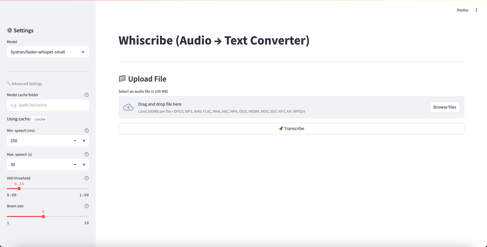
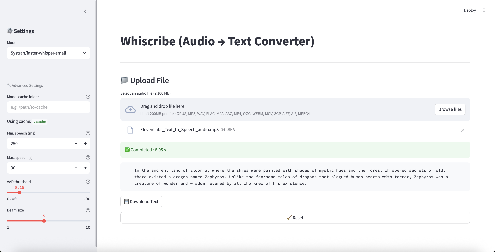

# 🎙️ Whiscribe (Audio → Text Converter)

**Whiscribe** is a lightweight, **CPU-only** speech-to-text app powered by [faster-whisper](https://github.com/SYSTRAN/faster-whisper).  
Run it in your browser with a simple Python script — no GPU required.

---

## ✨ Features

- **Runs entirely on CPU** — no GPU, MPS or external services required
- **Lightweight and minimal** — uses only `faster-whisper`, `streamlit` and `torch`  
- **Model flexibility** — supports all standard (major and multilingual) and distilled faster-whisper models
- **Fully configurable** — adjust VAD sensitivity, segment limits and beam size
- **Handles large files** — supports audio files up to 100 MB
- **MIT licensed** — free to use, modify and distribute

---

## 📸 Screenshots




---

## 🖥️ Requirements

| Requirement  | Notes                                  |
|--------------|----------------------------------------|
| Python 3.9+  | Tested with 3.9 and 3.12               |
| Packages     | `faster-whisper`, `streamlit`, `torch` |

---

## 🚀 Installation

```bash
# 1. Clone the repo
git clone https://github.com/sungurerdim/whiscribe.git
cd whiscribe

# 2. Create and activate a virtual environment
python -m venv venv
source venv/bin/activate   # On Windows: venv\Scripts\activate

# 3. Install dependencies
pip install --upgrade pip
pip install -r requirements.txt

# 4. Run the app
streamlit run whiscribe.py
```

## ⚙️ Usage
- Upload an audio file (`mp3`, `wav`, `m4a`, `aac`, `opus`, `flac`, `mp4`, `webm`, etc.) up to **100 MB**
- Adjust segment duration, VAD threshold or beam size if needed
- Click **“Transcribe”** and wait for a short while
- View, copy or download the transcript (as `.txt`)
- Click **Reset** to start over with a new file

## 📝 License
This project is licensed under the **MIT License**.
See the [LICENSE](LICENSE) file for details.
© 2025 **Sungur Zahid Erdim**

## 🤝 Contributing
Bug reports and pull requests are welcome!

> **Note:** This project was prepared with assistance from ChatGPT.